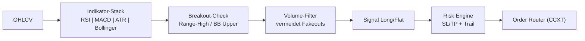

# 🌟 STBot - Strategic Trading Bot

<div align="center">


[](https://www.python.org/)
[](https://github.com/ccxt/ccxt)
[](LICENSE)

**Ein flexibler Multi-Asset Trading-Bot mit fortgeschrittener technischer Analyse und Risikomanagement**

[Features](#-features) • [Installation](#-installation) • [Optimierung](#-optimierung) • [Live-Trading](#-live-trading) • [Monitoring](#-monitoring) • [Wartung](#-wartung)

</div>

---

## 📊 Übersicht

STBot ist ein vielseitiger Trading-Bot, der mehrere Handelspaare gleichzeitig verwalten und verschiedene Timeframes optimal nutzen kann. Das System kombiniert technische Indikatoren mit intelligentem Risikomanagement für konsistente Performance.

### 🧭 Trading-Logik (Kurzfassung)
- **Breakout-Fokus**: Sucht Volumen-gestützte Ausbrüche über technische Schwellen (z.B. Bollinger-Band-Upper/Range-High) und meidet Chops.
- **Signal-Engine**: RSI/MACD/ATR/Bollinger liefern Long/Flat-Signale pro Symbol/Timeframe.
- **Trend-Filter**: Optionaler MACD verhindert Trades gegen den dominanten Trend.
- **Risk Layer**: Fixer SL/TP plus optionales Trailing; Positionsgröße über pro-Trade-Risiko gesteuert.
- **Portfolio-Sicht**: Mehrere Strategien laufen parallel; Kapitaleinsatz wird pro aktiver Strategie begrenzt.

### 🔍 Strategie-Visualisierung


### 📈 Trade-Beispiel (TP/SL/Trailing)
- Setup: Preis konsolidiert unter Range-High / BB-Upper; Volumen baut sich auf.
- Entry: Long auf Breakout-Close über Range-High.
- Initial SL: Unter Range-Mitte oder letztes Higher Low; ATR-basiert.
- TP: 2–3×SL-Distanz oder gemessenes Move-Target (Range-Höhe projiziert).
- Trailing: Nach +1×SL Distanz Trail unter das letzte Higher Low legen, um Trend-Fortsetzung mitzunehmen.

Architektur-Skizze:
```
OHLCV → Indikator-Stack → Signal (Long/Flat) → Risk Engine → Order Router (CCXT)
```

### 🎯 Hauptmerkmale

- **📈 Multi-Strategy**: Handel mehrerer Assets mit individualisierten Strategien
- **🔧 Flexible Configuration**: Einfache Anpassung für verschiedene Marktbedingungen
- **💰 Smart Capital Management**: Intelligente Kapitalverteilung
- **⚡ Fast Execution**: Optimiert für schnelle Order-Ausführung
- **📊 Comprehensive Analytics**: Detaillierte Performance-Analysen
- **🛡️ Risk Management**: Fortgeschrittenes Risikomanagement
- **🔔 Real-time Monitoring**: Live-Status und Benachrichtigungen

---

## 🚀 Features

### Trading Features
- ✅ Multi-Asset Trading (BTC, ETH, SOL, DOGE, XRP, ADA, AAVE)
- ✅ Multiple Timeframes (15m, 30m, 1h, 2h, 4h, 6h, 1d)
- ✅ Optionaler MACD-Filter für Signalvalidierung
- ✅ Dynamisches Position Sizing
- ✅ Stop-Loss/Take-Profit Management
- ✅ Trailing Stop-Loss
- ✅ Automatische Trade-Verwaltung

### Technical Features
- ✅ Technische Indikatoren (RSI, MACD, ATR, Bollinger Bands)
- ✅ Hyperparameter-Optimierung
- ✅ Backtesting mit realistischer Simulation
- ✅ Performance-Tracking
- ✅ Ausführliche Logging-Funktionen

---

## 📋 Systemanforderungen

### Hardware
- **CPU**: Dual-Core Prozessor oder besser
- **RAM**: Minimum 2GB, empfohlen 4GB+
- **Speicher**: 1GB freier Speicherplatz

### Software
- **OS**: Linux (Ubuntu 20.04+), macOS, Windows 10/11
- **Python**: Version 3.8 oder höher
- **Git**: Für Repository-Verwaltung

---

## 💻 Installation

### 1. Repository klonen

```bash
git clone https://github.com/Youra82/stbot.git
cd stbot
```

### 2. Automatische Installation

```bash
# Linux/macOS
chmod +x install.sh
./install.sh

# Windows (PowerShell)
python -m venv .venv
.venv\Scripts\activate
pip install -r requirements.txt
```

### 3. API-Credentials konfigurieren

Erstelle `secret.json`:

```json
{
  "stbot": [
    {
      "name": "Binance Account",
      "exchange": "binance",
      "apiKey": "DEIN_API_KEY",
      "secret": "DEIN_SECRET_KEY",
      "options": {
        "defaultType": "future"
      }
    }
  ]
}
```

### 4. Trading-Strategien konfigurieren

Bearbeite `settings.json`:

```json
{
  "live_trading_settings": {
    "use_auto_optimizer_results": false,
    "active_strategies": [
      {
        "symbol": "BTC/USDT:USDT",
        "timeframe": "6h",
        "use_macd_filter": false,
        "active": true
      },
      {
        "symbol": "ETH/USDT:USDT",
        "timeframe": "2h",
        "use_macd_filter": false,
        "active": true
      }
    ]
  }
}
```

---

## 🎯 Optimierung & Training

### Vollständige Pipeline

```bash
./run_pipeline.sh
```

Pipeline-Ablauf:
1. Alte Configs löschen (optional)
2. Symbole und Timeframes eingeben
3. Marktdaten herunterladen
4. Parameter optimieren
5. Backtest durchführen
6. Configs für Live-Trading generieren

### Manuelle Optimierung

```bash
source .venv/bin/activate
python src/stbot/analysis/optimizer.py
```

---

## 🔴 Live Trading

### Start

```bash
# Alle aktiven Strategien starten
python master_runner.py
```

### Manuell starten / Cronjob testen
Sofortige Ausführung auslösen (ohne 15-Minuten-Cron zu warten):

```bash
cd /home/ubuntu/stbot && /home/ubuntu/stbot/.venv/bin/python3 /home/ubuntu/stbot/master_runner.py
```

### Automatisiert

```bash
./run_pipeline_automated.sh
```

### Als Service (Linux)

```bash
sudo nano /etc/systemd/system/stbot.service
```

```ini
[Unit]
Description=STBot Trading System
After=network.target

[Service]
Type=simple
User=your-user
WorkingDirectory=/path/to/stbot
ExecStart=/path/to/stbot/.venv/bin/python master_runner.py
Restart=always

[Install]
WantedBy=multi-user.target
```

```bash
sudo systemctl enable stbot
sudo systemctl start stbot
```

---

## 📊 Monitoring

### Status anzeigen

```bash
./show_status.sh      # Vollständiger Status
./show_results.sh     # Ergebnisse
./show_chart.sh       # Charts generieren
python show_leverage.py  # Hebel-Status
```

### Logs überwachen

```bash
tail -f logs/live_trading_*.log
tail -f logs/error_*.log
grep "BTC/USDT" logs/*.log
```

---

## 🛠️ Wartung

### Updates

```bash
./update.sh
```

### Aufräumen

```bash
# Configs löschen
rm -f src/stbot/strategy/configs/config_*.json
ls -la src/stbot/strategy/configs/

# Daten löschen
rm -rf data/raw/* data/processed/*
du -sh data/*

# Kompletter Reset
rm -rf artifacts/* data/* logs/*
./install.sh
```

### Tests

```bash
./run_tests.sh
pytest tests/ -v
```

---

## 🔧 Nützliche Befehle

### Konfiguration

```bash
# Validieren
python -c "import json; print(json.load(open('settings.json')))"

# Backup
cp settings.json settings.json.backup.$(date +%Y%m%d)
```

### Prozess-Management

```bash
# Prozesse anzeigen
ps aux | grep python | grep stbot

# PID finden
pgrep -f master_runner.py

# Beenden
pkill -f master_runner.py
```

### Exchange

```bash
# Verbindung testen
python -c "from src.stbot.utils.exchange import Exchange; \
    e = Exchange('binance'); print(e.fetch_balance())"

# Positionen
python -c "from src.stbot.utils.exchange import Exchange; \
    e = Exchange('binance'); print(e.fetch_positions())"
```

---

## 📂 Projekt-Struktur

```
stbot/
├── src/stbot/
│   ├── analysis/          # Optimierung
│   ├── strategy/          # Trading-Logik
│   ├── backtest/          # Backtesting
│   └── utils/             # Utilities
├── tests/                 # Tests
├── data/                  # Marktdaten
├── logs/                  # Logs
├── artifacts/             # Ergebnisse
├── master_runner.py       # Main Script
├── settings.json          # Konfiguration
└── secret.json            # API-Keys
```

---

## ⚠️ Disclaimer

**Trading ist riskant! Nur Geld investieren, dessen Verlust Sie verkraften können.**

---

## 📜 Lizenz

MIT License - siehe [LICENSE](LICENSE)

---

<div align="center">

**Made with ❤️ for Algorithmic Trading**

⭐ Star this repo!

[🔝 Nach oben](#-stbot---strategic-trading-bot)

</div>
