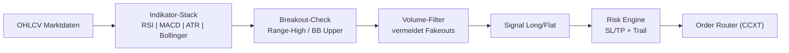

# 🌟 STBot - Strategic Trading Bot

<div align="center">


[](https://www.python.org/)
[](https://github.com/ccxt/ccxt)
[](LICENSE)

**Ein flexibler Multi-Asset Trading-Bot mit fortgeschrittener technischer Analyse, Breakout-Fokus und intelligentem Risikomanagement**

[Features](#-features) • [Installation](#-installation) • [Konfiguration](#-konfiguration) • [Live-Trading](#-live-trading) • [Pipeline](#-interaktives-pipeline-script) • [Monitoring](#-monitoring--status) • [Wartung](#-wartung)

</div>

---

## 📊 Übersicht

STBot ist ein vielseitiger Trading-Bot, der mehrere Handelspaare und verschiedene Timeframes gleichzeitig verwaltet. Das System kombiniert technische Indikatoren (RSI, MACD, ATR, Bollinger Bands) mit Breakout-Strategie für konsistente Performance.

### 🧭 Trading-Logik (Kurzfassung)
- **Breakout-Fokus**: Sucht Volumen-gestützte Ausbrüche über technische Schwellen (Bollinger-Band-Upper, Range-High)
- **Signal-Engine**: RSI/MACD/ATR/Bollinger liefern Long/Flat-Signale pro Symbol/Timeframe
- **Trend-Filter**: Optionaler MACD verhindert Trades gegen den dominanten Trend
- **Volumen-Check**: Vermeidet Fakeouts bei niedrigem Volumen
- **Risk Layer**: Fester SL/TP plus optionales Trailing; Positionsgröße über pro-Trade-Risiko gesteuert
- **Portfolio-Sicht**: Mehrere Strategien laufen parallel; Kapitaleinsatz wird pro aktiver Strategie begrenzt
- **Execution**: CCXT für Order-Platzierung mit realistischer Slippage-Simulation

### 🔍 Strategie-Visualisierung


### 📈 Trade-Beispiel (Entry/SL/TP)
- **Setup**: Preis konsolidiert unter Range-High oder Bollinger-Upper; Volumen baut sich auf
- **Entry**: Long auf Breakout-Close über Range-High mit Telegram-Alert
- **Initial SL**: Unter Range-Mitte oder letztes Higher Low; ATR-basiert
- **TP**: 2–3×SL-Distanz oder gemessenes Move-Target (Range-Höhe projiziert)
- **Trailing**: Nach +1×SL Distanz Trail unter das letzte Higher Low legen

---

## 🚀 Features

### Trading Features
- ✅ Multi-Asset Trading (BTC, ETH, SOL, DOGE, XRP, ADA, AAVE)
- ✅ Breakout-Strategie mit Volumen-Validierung
- ✅ Flexible Timeframe-Unterstützung (15m, 30m, 1h, 4h, 1d)
- ✅ Optionaler MACD-Filter für Signalvalidierung
- ✅ Dynamisches Position Sizing
- ✅ Stop-Loss/Take-Profit Management mit Trailing
- ✅ Automatische Trade-Verwaltung
- ✅ Telegram-Benachrichtigungen

### Technical Features
- ✅ CCXT Integration für mehrere Börsen
- ✅ Technische Indikatoren (RSI, MACD, ATR, Bollinger Bands)
- ✅ Hyperparameter-Optimierung mit Optuna
- ✅ Backtesting mit realistischer Slippage-Simulation
- ✅ Robust Error-Handling und Logging
- ✅ Walk-Forward-Analyse

---

## 📋 Systemanforderungen

### Hardware
- **CPU**: Dual-Core Prozessor oder besser
- **RAM**: Minimum 2GB, empfohlen 4GB+
- **Speicher**: 1GB freier Speicherplatz

### Software
- **OS**: Linux (Ubuntu 20.04+), macOS, Windows 10/11
- **Python**: Version 3.8 oder höher
- **Git**: Für Repository-Verwaltung

---

## 💻 Installation

### 1. Repository klonen

```bash
git clone https://github.com/Youra82/stbot.git
cd stbot
```

### 2. Automatische Installation (empfohlen)

```bash
# Linux/macOS
chmod +x install.sh
./install.sh

# Windows (PowerShell)
python -m venv .venv
.venv\Scripts\activate
pip install -r requirements.txt
```

Das Installations-Script führt folgende Schritte aus:
- ✅ Erstellt eine virtuelle Python-Umgebung (`.venv`)
- ✅ Installiert alle erforderlichen Abhängigkeiten
- ✅ Erstellt notwendige Verzeichnisse (`data/`, `logs/`, `artifacts/`)
- ✅ Initialisiert Konfigurationsdateien

### 3. API-Credentials konfigurieren

Erstelle eine `secret.json` Datei:

```json
{
  "stbot": [
    {
      "name": "Binance Trading Account",
      "exchange": "binance",
      "apiKey": "DEIN_API_KEY",
      "secret": "DEIN_SECRET_KEY",
      "options": {
        "defaultType": "future"
      }
    }
  ]
}
```

⚠️ **Wichtig**: 
- Niemals `secret.json` committen oder teilen!
- Verwende nur API-Keys mit eingeschränkten Rechten
- Aktiviere IP-Whitelist auf der Exchange

### 4. Trading-Strategien konfigurieren

Bearbeite `settings.json`:

```json
{
  "live_trading_settings": {
    "active_strategies": [
      {
        "symbol": "BTC/USDT:USDT",
        "timeframe": "4h",
        "use_macd_filter": false,
        "active": true
      },
      {
        "symbol": "ETH/USDT:USDT",
        "timeframe": "1h",
        "use_macd_filter": false,
        "active": true
      }
    ]
  }
}
```

**Parameter-Erklärung**:
- `symbol`: Handelspaar
- `timeframe`: Zeitrahmen
- `use_macd_filter`: MACD-Filter aktivieren
- `active`: Strategie aktiv

---

## 🔴 Live Trading

### Start des Live-Trading

```bash
# Master Runner starten
python master_runner.py
```

### Manuell starten / Cronjob testen

```bash
cd /home/ubuntu/stbot && /home/ubuntu/stbot/.venv/bin/python3 /home/ubuntu/stbot/master_runner.py
```

Der Master Runner:
- ✅ Lädt Konfigurationen aus `settings.json`
- ✅ Startet separate Prozesse für jede aktive Strategie
- ✅ Generiert Breakout-Signale
- ✅ Überwacht Kontostand und verfügbares Kapital
- ✅ Managed Positionen und Risk-Limits
- ✅ Loggt alle Trading-Aktivitäten
- ✅ Sendet Telegram-Benachrichtigungen

### Automatischer Start (Produktions-Setup)

```bash
crontab -e
```

```
# Starte den STBot Master-Runner alle 15 Minuten
*/15 * * * * /usr/bin/flock -n /home/ubuntu/stbot/stbot.lock /bin/sh -c "cd /home/ubuntu/stbot && /home/ubuntu/stbot/.venv/bin/python3 /home/ubuntu/stbot/master_runner.py >> /home/ubuntu/stbot/logs/cron.log 2>&1"
```

Logverzeichnis:

```bash
mkdir -p /home/ubuntu/stbot/logs
```


---

## 📊 Interaktives Pipeline-Script

Das **`run_pipeline.sh`** Script automatisiert die Parameter-Optimierung. Es führt einen Grid-Search über alle Breakout- und Indikator-Parameter durch.

### Features des Pipeline-Scripts

✅ **Interaktive Eingabe** - Einfache Menü-Navigation  
✅ **Automatische Datumswahl** - Zeitrahmen-basierte Lookback-Berechnung  
✅ **Optuna-Optimierung** - Bayessche Hyperparameter-Suche  
✅ **Batch-Optimierung** - Mehrere Symbol/Timeframe-Kombinationen  
✅ **Automatisches Speichern** - Optimale Konfigurationen  
✅ **Integrierte Backtests** - Sofort nach Optimierung testen  

### Verwendung

```bash
chmod +x run_pipeline.sh
./run_pipeline.sh
```

### Optimierte Konfigurationen

```
artifacts/optimal_configs/
├── optimal_BTCUSDT_4h.json
└── ...
```

**Beispiel-Konfiguration**:

```json
{
  "symbol": "BTCUSDT",
  "timeframe": "4h",
  "parameters": {
    "rsi_period": 14,
    "rsi_threshold": 50,
    "macd_fast": 12,
    "macd_slow": 26,
    "bollinger_period": 20,
    "bollinger_std": 2.0,
    "atr_period": 14,
    "volume_ratio": 1.2
  },
  "performance": {
    "total_return": 6.50,
    "win_rate": 58.8,
    "num_trades": 17,
    "max_drawdown": -5.80,
    "end_capital": 650.00
  }
}
```

---

## 📊 Monitoring & Status

### Status-Dashboard

```bash
./show_status.sh
```

### Log-Files

```bash
tail -f logs/cron.log
tail -f logs/error.log
tail -n 100 logs/stbot_BTCUSDTUSDT_4h.log
```


---

## 🛠️ Wartung & Pflege

### Logs ansehen

```bash
tail -f logs/cron.log
tail -n 200 logs/cron.log
grep -i "ERROR" logs/cron.log
```

### Bot aktualisieren

```bash
chmod +x update.sh
bash ./update.sh
```


### Tests ausführen

```bash
./run_tests.sh
pytest tests/test_strategy.py -v
pytest --cov=src tests/
```

---

## 📂 Projekt-Struktur

```
stbot/
├── src/
│   └── stbot/
│       ├── strategy/          # Trading-Logik
│       │   ├── run.py
│       │   └── breakout_detector.py
│       ├── backtest/          # Backtesting
│       │   └── backtester.py
│       └── utils/             # Hilfsfunktionen
│           ├── exchange.py
│           └── telegram.py
├── scripts/
├── tests/
├── data/
├── logs/
├── artifacts/
├── master_runner.py
├── settings.json
├── secret.json
└── requirements.txt
```

---

## ⚠️ Wichtige Hinweise

### Risiko-Disclaimer

⚠️ **Trading mit Kryptowährungen birgt erhebliche Risiken!**

- Nur Kapital einsetzen, dessen Verlust Sie verkraften können
- Keine Garantie für Gewinne
- Vergangene Performance ist kein Indikator
- Testen Sie mit Demo-Accounts
- Starten Sie mit kleinen Beträgen

### Security Best Practices

- 🔐 Keine API-Keys mit Withdrawal-Rechten
- 🔐 IP-Whitelist aktivieren
- 🔐 2FA verwenden
- 🔐 `secret.json` niemals committen
- 🔐 Regelmäßige Updates

### Performance-Tipps

- 💡 Starten Sie mit 1-2 Strategien
- 💡 Längere Timeframes für stabilere Signale
- 💡 Monitoren Sie regelmäßig
- 💡 Parameter regelmäßig optimieren
- 💡 Position-Sizing angemessen konfigurieren

---

## 🤝 Support & Community

### Probleme melden

1. Prüfen Sie die Logs
2. Führen Sie Tests aus
3. Öffnen Sie ein Issue

### Updates

```bash
git fetch origin
./update.sh
```

### Hochladen

```bash
git add artifacts/optimal_configs/*.json
git commit -m "Update: Optimierte Parameter"
git push origin main
```

---

## 📜 Lizenz

Dieses Projekt ist lizenziert unter der MIT License.

---

## 🙏 Credits

Entwickelt mit:
- [CCXT](https://github.com/ccxt/ccxt)
- [Pandas](https://pandas.pydata.org/)
- [TA-Lib](https://github.com/mrjbq7/ta-lib)

---

<div align="center">

**Made with ❤️ by the STBot Team**

⭐ Star uns auf GitHub wenn dir dieses Projekt gefällt!

[🔝 Nach oben](#-stbot---strategic-trading-bot)

</div>
