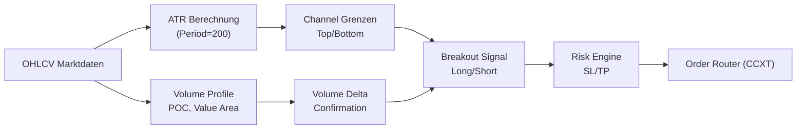

# 📊 KBot - Stoch RSI Trading Bot

<div align="center">


[](https://www.python.org/)
[](https://github.com/ccxt/ccxt)
[](LICENSE)

**Ein vollautomatisierter Trading-Bot für Krypto-Futures mit ATR-basierten dynamischen Kanälen, Volume Profile und Breakout-Strategie**

[Features](#-features) • [Installation](#-installation) • [Quick Start](#-quick-start) • [Pipeline](#-pipeline--parameter-optimierung) • [Backtesting](#-backtesting) • [Wartung](#-wartung)

</div>

---

## 📊 Übersicht

KBot ist ein Trend‑Following System, das **Stochastic RSI (Stoch‑RSI)** als primäre Handelsstrategie verwendet. Der Bot erzeugt K/D‑Signale aus dem Stoch‑RSI, nutzt ATR für SL/TP‑Sizing und unterstützt Long/Short‑Ein- und Ausstiege über standardisierte Konfigurationen.

### 🧭 Trading-Logik (Kurzfassung)
- **ATR-Kanal**: Dynamische obere/untere Grenzen (ATR × Channel_Width um HL2 = Typical Price)
- **Stoch‑RSI**: Signal-Generator (K/D Kreuzungen, OB/OS), ATR‑SL/TP für Order‑Sizing
- **Optional**: Volumen‑Filter können zusätzlich als Confirmation genutzt werden (nicht primär für Stoch‑RSI).
- **Entry Long**: Close > Channel Top + (optional) positive Volume Delta
- **Entry Short**: Close < Channel Bottom + (optional) negative Volume Delta
- **Stop-Loss**: Gegenüberliegende Kanal-Grenze
- **Take-Profit**: Entry + (SL-Distance × Risk-Reward-Ratio)

### 🔍 Strategie-Visualisierung

```mermaid
flowchart LR
    A["OHLCV Marktdaten"]
    B["ATR Berechnung<br/>(Period=200)"]
    C["Channel Grenzen<br/>Top/Bottom"]
    D["Volume Profile<br/>POC, Value Area"]
    E["Volume Delta<br/>Confirmation"]
    F["Breakout Signal<br/>Long/Short"]
    G["Risk Engine<br/>SL/TP"]
    H["Order Router (CCXT)"]

    A --> B --> C
    A --> D --> E
    C --> F
    E --> F
    F --> G --> H
```

### 📈 Trade-Beispiel (Entry/SL/TP)
- **Channel**: ATR(200) berechnet; Channel Top = 50000, Bottom = 48000
- **Entry (Long)**: Stoch‑RSI K kreuzt über Oversold → Long Signal (Bestätigung: K > D)
- **Entry**: Automatischer Einstieg bei Channel Top Durchbruch
- **SL**: Bei 48000 (Channel Bottom)
- **TP**: Entry + (2000 × 2.0 RR) = 54000
- **Trend**: Klare Richtungsbias durch Channel Position
- **Entry Long**: Automatischer Einstieg bei Konfluenz
- **TP1**: Bei PoC (Point of Control) - 50% Position schließen
- **TP2**: Bei upper_6 - Rest schließen
- **SL**: Unter lower_1

---

## 🚀 Features

### Trading Features
- ✅ **Stoch‑RSI** Strategie - K/D‑Kreuzungen + ATR‑SL/TP basierte Positionssteuerung
- ✅ **Volume Profile Integration** - POC (Point of Control), Value Area
- ✅ **Volume Delta Confirmation** - Bullish/Bearish Volumen-Akkumulation
- ✅ **Breakout-Trading** - Long bei Kanal-Ausbruch nach oben, Short nach unten
- ✅ **Long & Short Trading** - Bidirektionales Trend-Following
- ✅ Unterstützt mehrere Kryptowährungspaare (BTC, ETH, SOL, ADA, DOGE, XRP, etc.)
- ✅ Flexible Timeframe-Unterstützung (15m, 30m, 1h, 4h, 6h, 1d, 1w)
- ✅ Automatische Positionsgröße basierend auf verfügbarem Kapital und Leverage
- ✅ ATR-basiertes Stop-Loss und Take-Profit Management
- ✅ Optuna-basierte Parameter-Optimierung

### Technical Features
- ✅ CCXT Integration (Bitget, Binance, Kraken, etc.)
- ✅ ATR-Berechnung mit anpassbarer Periode (default: 200)
- ✅ Volume Profile Analyse pro Kerzen-Segment
- ✅ Live Backtesting mit realistischer Slippage-Simulation
- ✅ Optuna Parameter-Optimierung (Hyperparameter Tuning)
- ✅ Robust Error-Handling und Logging
- ✅ Pipeline-Automation mit fortlaufender Optimierung

### Stoch‑RSI — Parameter

| Parameter | Beschreibung | Default | Bereich |
|-----------|-------------|---------|---------|
| **rsi_period** | RSI Periode zur Berechnung | 14 | 7-21 |
| **stochrsi_len** | Lookback für Stoch‑RSI Normalisierung | 14 | 7-21 |
| **k** | %K Glättung (Stoch‑RSI) | 3 | 1-5 |
| **d** | %D Glättung (Stoch‑RSI) | 3 | 1-5 |
| **ob** | Overbought‑Schwelle (0..1) | 0.8 | 0.6-0.95 |
| **os** | Oversold‑Schwelle (0..1) | 0.2 | 0.05-0.4 |
| **atr_period** | ATR Periode für SL/TP‑Sizing | 14 | 7-50 |
| **sl_atr_mult** | SL-Multiplier basierend auf ATR | 1.5 | 0.8-3.0 |
| **risk_reward_ratio** | TP zu SL Verhältnis | 2.0 | 1.2-4.0 |
| **risk_per_trade_pct** | Risiko pro Trade in % | 1.0 | 0.5-2.0 |
| **leverage** | Hebel für Positionen | 5 | 1-20 |

---

## ⚡ Quick Start

### 1. Installation (erste Einrichtung)

```bash
git clone https://github.com/Youra82/kbot.git
cd kbot
./install.sh              # Linux/macOS
# oder Windows:
python -m venv .venv
.venv\Scripts\activate
pip install -r requirements.txt
```

### 2. API-Credentials konfigurieren

Erstelle `secret.json`:
```bash
cp secret.json.template secret.json
# Bearbeite secret.json mit API-Keys
nano secret.json  # oder dein Lieblings-Editor
```

### 3. Parameter-Optimierung durchführen

```bash
bash ./run_pipeline.sh
# Folge den Prompts:
# - Handelspaare eingeben (z.B. BTC ETH)
# - Timeframes eingeben (z.B. 4h 1d)
# - Startdatum (optional, 'a' für Automatik)
# - Trials eingeben (z.B. 100)
```

Dies erstellt optimierte Konfigurationen in `src/kbot/strategy/configs/config_*.json`

### 4. Ergebnisse analysieren & Live-Trading starten

```bash
# Backtests anschauen
./show_results.sh
# Wähle Modus 1 (Einzel-Analyse) und antworte auf Fragen

# Bot starten
python master_runner.py
```

### 5. Alte Konfigurationen löschen (Neustart)

Wenn du eine komplett neue Optimierung starten möchtest:

```bash
# Alle Konfigurationsdateien löschen
rm -f src/kbot/strategy/configs/config_*.json

# Oder über die Pipeline:
bash ./run_pipeline.sh
# Bei der ersten Abfrage "Möchtest du alle alten Konfigurationen löschen?" -> j
```

---

## 📊 Pipeline & Backtesting

### Parameter-Optimierung (run_pipeline.sh)

Die Pipeline optimiert die Stoch‑RSI Parameter automatisch:

```bash
bash ./run_pipeline.sh

# Interaktive Abfragen:
# 1. Alte Configs löschen? (j/n)
# 2. Handelspaare (z.B. BTC ETH SOL)
# 3. Timeframes (z.B. 1h 4h 1d)
# 4. Startdatum (YYYY-MM-DD oder 'a' für Automatik)
# 5. Enddatum (YYYY-MM-DD)
# 6. Startkapital (USDT)
# 7. Anzahl Trials (z.B. 100)
# 8. Modus: Streng oder Best-Profit
# 9. Max Drawdown %
```

**Parameter die optimiert werden:**
- `rsi_period`: 7-21
- `stochrsi_len`: 7-21
- `k`: 1-5
- `d`: 1-5
- `ob`: 0.6-0.95 (Schritt: 0.05)
- `os`: 0.05-0.4 (Schritt: 0.05)
- `atr_period`: 7-50
- `sl_atr_mult`: 0.8-3.0 (Schritt: 0.1)
- `risk_reward_ratio`: 1.2-4.0
- `risk_per_trade_pct`: 0.5-2.0
- `leverage`: 1-20

### Backtesting (show_results.sh)

```bash
./show_results.sh

# Modus-Auswahl:
# 1) Einzel-Analyse - Testet alle Strategien einzeln
# 2) Portfolio-Simulation - Wähle Strategien manuell aus
# 3) Portfolio-Optimierung - Bot wählt beste Kombination
# 4) Interaktive Charts (noch in Entwicklung)

# Dann: Startdatum, Enddatum, Startkapital eingeben
```

**Output Modus 1 (Einzel-Analyse):**
```
Strategie              Trades  Win-Rate  PnL %  Max DD  PF    Endkapital
BTC/USDT:USDT (1d)    45      56.7%     12.45 15.23   1.32  1124.50
ETH/USDT:USDT (4h)    23      52.2%     -1.23 18.50   0.95  987.70
```

---

## 🟢 Live-Trading starten

### Master Runner

```bash
# Bot mit allen aktivierten Strategien starten
python master_runner.py

# Output:
# INFO: Starte 5 Handelspaare
# INFO: BTC/USDT:USDT (1d): Channel Top=50100, Bot=48900
# INFO: ETH/USDT:USDT (4h): Bearish Trend - Abwarten
# ...
```

### Status prüfen

```bash
./show_status.sh          # Quick Status
tail -f logs/kbot_*.log   # Live Logs anschauen
```

### Trade-Events filtern

```bash
grep 'LONG\|SHORT' logs/*.log     # Nur Entry-Signale
grep 'Closed' logs/*.log          # Nur Closes
grep 'ERROR' logs/*.log           # Fehler prüfen
```

---

## ⚙️ Konfiguration

---

## 📋 Systemanforderungen

### Hardware
- **CPU**: Multi-Core Prozessor (Intel i5 oder besser empfohlen)
- **RAM**: Minimum 2GB, empfohlen 4GB+
- **Speicher**: 1GB freier Speicherplatz

### Software
- **OS**: Linux (Ubuntu 20.04+), macOS, Windows 10/11
- **Python**: Version 3.8 oder höher
- **Git**: Für Repository-Verwaltung

---

## 💻 Installation

### 1. Repository klonen

```bash
git clone https://github.com/Youra82/kbot.git
cd kbot
```

### 2. Automatische Installation (empfohlen)

```bash
# Linux/macOS
chmod +x install.sh
./install.sh

# Windows (PowerShell)
python -m venv .venv
.venv\Scripts\activate
pip install -r requirements.txt
```

Das Installations-Script führt folgende Schritte aus:
- ✅ Erstellt eine virtuelle Python-Umgebung (`.venv`)
- ✅ Installiert alle erforderlichen Abhängigkeiten
- ✅ Erstellt notwendige Verzeichnisse (`data/`, `logs/`, `artifacts/`)
- ✅ Initialisiert Konfigurationsdateien

### 3. API-Credentials konfigurieren

Erstelle eine `secret.json` Datei im Root-Verzeichnis:

```json
{
  "kbot": [
    {
      "name": "Bitget Trading Account",
      "exchange": "bitget",
      "apiKey": "DEIN_API_KEY",
      "secret": "DEIN_SECRET_KEY",
      "passphrase": "DEIN_PASSPHRASE",
      "options": {
        "defaultType": "future"
      }
    }
  ]
}
```

⚠️ **Wichtig**: 
- Niemals `secret.json` committen oder teilen!
- Verwende nur API-Keys mit eingeschränkten Rechten (Nur Trading, keine Withdrawals)
- Aktiviere IP-Whitelist auf der Exchange

### 4. Trading-Strategien konfigurieren

Bearbeite `settings.json` für deine gewünschten Handelspaare:

```json
{
  "live_trading_settings": {
    "active_strategies": [
      {
        "symbol": "BTC/USDT:USDT",
        "timeframe": "4h",
        "active": true
      },
      {
        "symbol": "ETH/USDT:USDT",
        "timeframe": "1h",
        "active": true
      }
    ]
  }
}
```

### Parameter-Erklärung**:
- `symbol`: Handelspaar (Format: BASE/QUOTE:SETTLE)
- `timeframe`: Zeitrahmen (15m, 30m, 1h, 4h, 1d)
- `active`: Strategie aktiv (true/false)
- `use_macd_filter`: Optional - MACD-Filter für zusätzliche Signalbestätigung

---

## 🔴 Live Trading

### Start des Live-Trading

```bash
# Master Runner starten (verwaltet alle aktiven Strategien)
python master_runner.py
```

### Manuell starten / Cronjob testen
Ausführung sofort anstoßen (ohne auf den 15-Minuten-Cron zu warten):

```bash
cd /home/ubuntu/kbot && /home/ubuntu/kbot/.venv/bin/python3 /home/ubuntu/kbot/master_runner.py
```

Der Master Runner:
- ✅ Lädt Konfigurationen aus `settings.json`
- ✅ Startet separate Prozesse für jede aktive Strategie
- ✅ Überwacht Kontostand und verfügbares Kapital
- ✅ Managed Positionen und Risk-Limits
- ✅ Loggt alle Trading-Aktivitäten
- ✅ Sendet Telegram-Benachrichtigungen für neue Kanäle

### Automatischer Start (Produktions-Setup)

Richte den automatischen Prozess für den Live-Handel ein.

```bash
crontab -e
```

Füge die folgende **eine Zeile** am Ende der Datei ein. Passe den Pfad an, falls dein Bot nicht unter `/home/ubuntu/kbot` liegt.

```
# Starte den KBot Master-Runner alle 15 Minuten
*/15 * * * * /usr/bin/flock -n /home/ubuntu/kbot/kbot.lock /bin/sh -c "cd /home/ubuntu/kbot && /home/ubuntu/kbot/.venv/bin/python3 /home/ubuntu/kbot/master_runner.py >> /home/ubuntu/kbot/logs/cron.log 2>&1"
```

*(Hinweis: `flock` ist eine gute Ergänzung, um Überlappungen zu verhindern, aber für den Start nicht zwingend notwendig.)*

Logverzeichnis anlegen:

```bash
mkdir -p /home/ubuntu/kbot/logs
```

## � Interaktives Pipeline-Script

Das **`run_pipeline.sh`** Script automatisiert die Parameter-Optimierung für deine Handelsstrategien. Es führt einen Grid-Search über die Fibonacci Bollinger Bands Parameter durch und findet die optimalen Einstellungen für dein ausgewähltes Symbol und Timeframe.

### Features des Pipeline-Scripts

✅ **Interaktive Eingabe** - Einfache Menü-Navigation  
✅ **Automatische Datumswahl** - Zeitrahmen-basierte Lookback-Berechnung  
✅ **Ladebalken** - Visueller Fortschritt mit tqdm  
✅ **Batch-Optimierung** - Mehrere Symbol/Timeframe-Kombinationen  
✅ **Automatisches Speichern** - Optimale Konfigurationen als JSON  
✅ **Integrierte Backtests** - Sofort nach Optimierung testen  

### Verwendung

```bash
# Pipeline starten
chmod +x run_pipeline.sh
./run_pipeline.sh
```

### Interaktive Eingaben

Das Script fragt dich nach folgende Informationen:

#### 1. Symbol eingeben
```
Welche(s) Symbol(e) möchtest du optimieren?
(z.B. BTC oder: BTC ETH SOL)
> BTC
```

#### 2. Timeframe eingeben
```
Welche(s) Timeframe(s)?
(z.B. 1d oder: 1d 4h 1h)
> 1d
```

#### 3. Startdatum eingeben
```
Startdatum (YYYY-MM-DD oder 'a' für automatisch)?
Automatische Optionen pro Timeframe:
  5m/15m    → 60 Tage Lookback
  30m/1h    → 180 Tage Lookback
  4h/2h     → 365 Tage Lookback
  6h/1d     → 730 Tage Lookback
> a
```

**Automatisches Datum**: Das Script berechnet das Startdatum basierend auf dem Timeframe:
- **5m/15m**: Letzte 60 Tage
- **30m/1h**: Letzte 180 Tage (6 Monate)
- **4h/2h**: Letzte 365 Tage (1 Jahr)
- **6h/1d**: Letzte 730 Tage (2 Jahre)

Oder gib manuell ein Datum ein:
```
Startdatum (YYYY-MM-DD oder 'a' für automatisch)?
> 2024-01-01
```

#### 4. Startkapital eingeben
```
Mit wieviel USD starten? (Standard: 100)
> 100
```

### Beispiel-Session

```bash
$ ./run_pipeline.sh

═══════════════════════════════════════════════════════════
     🤖 KBot - Interaktives Optimierungs-Pipeline
═══════════════════════════════════════════════════════════

Welche(s) Symbol(e) möchtest du optimieren?
(z.B. BTC oder: BTC ETH SOL)
> BTC ETH

Welche(s) Timeframe(s)?
(z.B. 1d oder: 1d 4h 1h)
> 1d 4h

Startdatum (YYYY-MM-DD oder 'a' für automatisch)?
[Info] Automatisches Datum:
  • BTC (1d): 2023-01-02
  • ETH (1d): 2023-01-02
  • BTC (4h): 2023-01-02
  • ETH (4h): 2023-01-02
> a

Mit wieviel USD starten? (Standard: 100)
> 500

═══════════════════════════════════════════════════════════
Starte Optimierung für folgende Strategien:
  • BTC (1d)
  • ETH (1d)
  • BTC (4h)
  • ETH (4h)
═══════════════════════════════════════════════════════════

[1/4] Optimiere BTC (1d) vom 2023-01-02 bis 2025-12-31...
Optimiere BTC (1d): 100%|█████████████| 243/243 [00:02<00:00, 110.65combo/s]

✅ OPTIMALE PARAMETER GEFUNDEN für BTC (1d)
  • Endkapital: $512.25
  • Gesamtrendite: 2.45%
  • Anzahl Trades: 3
  • Gewinnquote: 66.7%
  • Max Drawdown: -8.38%

[2/4] Optimiere ETH (1d) vom 2023-01-02 bis 2025-12-31...
Optimiere ETH (1d): 100%|█████████████| 243/243 [00:02<00:00, 115.32combo/s]

✅ OPTIMALE PARAMETER GEFUNDEN für ETH (1d)
  • Endkapital: $545.80
  • Gesamtrendite: 9.16%
  • Anzahl Trades: 5
  • Gewinnquote: 80.0%
  • Max Drawdown: -5.12%

[3/4] Optimiere BTC (4h) vom 2023-01-02 bis 2025-12-31...
[4/4] Optimiere ETH (4h) vom 2023-01-02 bis 2025-12-31...

═══════════════════════════════════════════════════════════
✅ Optimierung abgeschlossen!
Konfigurationen gespeichert unter: artifacts/optimal_configs/
═══════════════════════════════════════════════════════════

Möchtest du die Ergebnisse jetzt anschauen?
> y

[Startet show_results.sh...]
```

### Optimierte Konfigurationen

Nach erfolgreicher Optimierung werden die besten Parameter als JSON-Dateien gespeichert:

```
artifacts/optimal_configs/
├── optimal_BTCUSDT_1d.json
├── optimal_BTCUSDT_4h.json
├── optimal_ETHUSDT_1d.json
└── optimal_ETHUSDT_4h.json
```

**Beispiel-Konfiguration** (`optimal_BTCUSDT_1d.json`):

```json
{
  "symbol": "BTCUSDT",
  "timeframe": "1d",
  "parameters": {
    "length": 200,
    "multiplier": 3.0,
    "entry_level": "lower_6",
    "exit_level": "upper_6"
  },
  "performance": {
    "total_return": 12.45,
    "win_rate": 68.5,
    "num_trades": 8,
    "max_drawdown": -6.2,
    "end_capital": 1124.50
  },
  "timestamp": "2026-01-05T14:30:00.000000"
}
```

### Integration mit Live-Trading

Die optimierten Konfigurationen werden **automatisch geladen**, wenn du `show_results.sh` ausführst:

```bash
./show_results.sh
```

Das Script lädt die optimalen Parameter und nutzt sie für die Backtests:
- ✅ Bessere Ergebnisse durch optimierte Parameter
- ✅ Konsistente Strategie-Ausführung
- ✅ Einfaches A/B-Testing von Parametern

## 🤖 Auto-Optimizer Scheduler

Automatische Optimierung nach Zeitplan mit Telegram-Benachrichtigungen.

```bash
# Status prüfen
python3 auto_optimizer_scheduler.py --check-only

# Sofort optimieren
python3 auto_optimizer_scheduler.py --force

# Als Daemon laufen
python3 auto_optimizer_scheduler.py --daemon
```

Konfiguration in `settings.json`:
```json
"optimization_settings": {
    "enabled": true,
    "schedule": { "day_of_week": 0, "hour": 3, "interval_days": 7 },
    "symbols_to_optimize": "auto",
    "timeframes_to_optimize": "auto"
}
```

## 📊 Monitoring & Status

### Status-Dashboard

```bash
# Einmalig ausführbar machen
chmod +x show_status.sh

# Status anzeigen
./show_status.sh
```

**Angezeigt**:
- 📊 Aktuelle Konfiguration (`settings.json`)
- 🔐 API-Status (ohne Credentials)
- 📈 Offene Positionen
- 💰 Kontostand und verfügbares Kapital
- 📝 Letzte Logs

### Trading-Ergebnisse anzeigen

```bash
# Einmalig ausführbar machen
chmod +x show_results.sh

# Ergebnisse anzeigen
./show_results.sh
```

### Log-Files

```bash
# Live-Trading Logs (Zentrale Log-Datei)
tail -f logs/cron.log

# Fehler-Logs
tail -f logs/error.log

# Logs einer individuellen Strategie
tail -n 100 logs/kbot_BTCUSDTUSDT_4h.log

# Nach Fibonacci-Band-Signalen suchen
tail -f logs/cron.log | grep -i "lower_6\|upper_6\|fib"
```

---

## 🛠️ Wartung & Pflege

### Tägliche Verwaltung

#### Logs ansehen

Die zentrale `cron.log`-Datei enthält **alle** wichtigen Informationen vom Scheduler und den Handels-Entscheidungen.

  * **Logs live mitverfolgen (der wichtigste Befehl):**

    ```bash
    tail -f logs/cron.log
    ```

    *(Mit `Strg + C` beenden)*

  * **Die letzten 200 Zeilen der zentralen Log-Datei anzeigen:**

    ```bash
    tail -n 200 logs/cron.log
    ```

  * **Zentrale Log-Datei nach Fehlern durchsuchen:**

    ```bash
    grep -i "ERROR" logs/cron.log
    ```

#### Cronjob manuell testen

Um den `master_runner` sofort auszuführen, ohne auf den nächsten 15-Minuten-Takt zu warten:

```bash
cd /home/ubuntu/kbot && /home/ubuntu/kbot/.venv/bin/python3 /home/ubuntu/kbot/master_runner.py
```

### Bot aktualisieren

Um die neueste Version des Codes von deinem Git-Repository zu holen:

```bash
# Update aktivieren (einmalig)
chmod +x update.sh

# Update ausführen
bash ./update.sh
```

---

## 🔄 Auto-Optimizer Verwaltung

Der Bot verfügt über einen automatischen Optimizer, der wöchentlich die besten Parameter für alle aktiven Strategien sucht.

### Optimizer manuell triggern

Um eine sofortige Optimierung zu starten (ignoriert das Zeitintervall):

```bash
# Letzten Optimierungszeitpunkt löschen (erzwingt Neustart)
rm ~/kbot/data/cache/.last_optimization_run

# Master Runner starten (prüft ob Optimierung fällig ist)
cd ~/kbot && .venv/bin/python3 master_runner.py
```

### Optimizer-Logs überwachen

```bash
# Optimizer-Log live mitverfolgen
tail -f ~/kbot/logs/optimizer_output.log

# Letzte 50 Zeilen des Optimizer-Logs anzeigen
tail -50 ~/kbot/logs/optimizer_output.log
```

### Optimierungsergebnisse ansehen

```bash
# Beste gefundene Parameter anzeigen (erste 50 Zeilen)
cat ~/kbot/artifacts/results/optimization_results.json | head -50
```

### Optimizer-Prozess überwachen

```bash
# Prüfen ob Optimizer gerade läuft (aktualisiert jede Sekunde)
watch -n 1 "ps aux | grep optimizer"
```

### ⚡ Paralleler Betrieb: Trading & Optimizer

Der Optimizer läuft **vollständig parallel** zum Trading und blockiert keine Trades:

```
Cron (jede Stunde)
│
├─► master_runner.py startet
│   │
│   ├─► main() → Startet Bot-Prozesse (z.B. 7 Strategien)
│   │            Jeder Bot ist ein eigener Prozess
│   │
│   └─► check_and_run_optimizer() → Startet Optimizer im Hintergrund
│
└─► master_runner.py BEENDET SICH (nach ~15 Sekunden)

═══════════════════════════════════════════════════════════════

Jetzt laufen PARALLEL und UNABHÄNGIG:

┌─────────────────┐  ┌─────────────────┐  ┌─────────────────┐
│ Bot: BTC/USDT   │  │ Bot: ETH/USDT   │  │ Bot: SOL/USDT   │
│ (Prozess 1234)  │  │ (Prozess 1235)  │  │ (Prozess 1236)  │
│                 │  │                 │  │                 │
│ ✅ Handelt      │  │ ✅ Handelt      │  │ ✅ Handelt      │
│ ✅ Öffnet Pos.  │  │ ✅ Öffnet Pos.  │  │ ✅ Öffnet Pos.  │
│ ✅ Schließt     │  │ ✅ Schließt     │  │ ✅ Schließt     │
└─────────────────┘  └─────────────────┘  └─────────────────┘
        ↑                    ↑                    ↑
        │                    │                    │
        └────────────────────┴────────────────────┘
                    Handeln weiter normal!

┌─────────────────────────────────────────────────────────────┐
│              OPTIMIZER (Prozess 9999)                       │
│                                                             │
│  Läuft im Hintergrund (kann 1-3 Stunden dauern)            │
│  - Testet Parameter                                         │
│  - Berechnet Backtests                                      │
│  - Nutzt CPU, aber stört Trading nicht                     │
│                                                             │
│  ➡️ Sendet Telegram wenn fertig                            │
└─────────────────────────────────────────────────────────────┘
```

| Aspekt | Trading-Bots | Optimizer |
|--------|--------------|-----------|  
| **Prozess** | Eigene Prozesse pro Strategie | Eigener Hintergrundprozess |
| **API-Calls** | Ja (Exchange API) | Nur historische Daten |
| **Blockiert?** | Nein | Nein |
| **Dauer** | Läuft und beendet sich schnell | Kann Stunden dauern |
| **Nächster Cron** | Startet neue Bot-Instanzen | Prüft ob schon läuft |

---

## 📂 Projekt-Struktur

```
kbot/
├── src/
│   └── kbot/
│       ├── strategy/          # Trading-Logik
│       │   ├── run.py         # Fibonacci Bollinger Bands Strategie
│       │   └── configs/       # Strategie-Konfigurationen
│       ├── analysis/          # Analyse-Tools
│       └── utils/             # Hilfsfunktionen
│           ├── exchange.py
│           └── telegram.py
├── tests/                     # Unit-Tests
├── data/                      # Marktdaten & Cache
├── logs/                      # Log-Files
├── artifacts/                 # Ergebnisse
│   ├── models/
│   ├── db/
│   └── optimal_configs/       # Optimierte Parameter
├── master_runner.py          # Haupt-Entry-Point
├── settings.json             # Konfiguration
├── secret.json               # API-Credentials
└── requirements.txt          # Dependencies
```

---

## ⚠️ Wichtige Hinweise

### Risiko-Disclaimer

⚠️ **Trading mit Kryptowährungen birgt erhebliche Risiken!**

- Nur Kapital einsetzen, dessen Verlust Sie verkraften können
- Keine Garantie für Gewinne
- Vergangene Performance ist kein Indikator für zukünftige Ergebnisse
- Testen Sie ausgiebig mit Demo-Accounts
- Starten Sie mit kleinen Beträgen

### Security Best Practices

- 🔐 Niemals API-Keys mit Withdrawal-Rechten verwenden
- 🔐 IP-Whitelist auf Exchange aktivieren
- 🔐 2FA für Exchange-Account aktivieren
- 🔐 `secret.json` niemals committen (in `.gitignore`)
- 🔐 Regelmäßige Security-Updates durchführen

### Performance-Tipps

- 💡 Starten Sie mit 1-2 Strategien
- 💡 Verwenden Sie längere Timeframes (4h+) für stabilere Fibonacci-Signale
- 💡 Monitoren Sie regelmäßig die Performance
- 💡 VWMA-Length und Multiplier regelmäßig überprüfen
- 💡 Position-Sizing angemessen konfigurieren
- 💡 Aktivieren Sie den MACD-Filter für zusätzliche Signal-Bestätigung

---

## 🤝 Support & Community

### Probleme melden

Bei Problemen oder Fragen:

1. Prüfen Sie die Logs in `logs/`
2. Führen Sie Tests aus: `./run_tests.sh`
3. Öffnen Sie ein Issue auf GitHub mit:
   - Beschreibung des Problems
   - Relevante Log-Auszüge
   - System-Informationen
   - Schritte zur Reproduktion

### Optimierte Konfigurationen auf Repo hochladen

Nach erfolgreicher Parameter-Optimierung können die Konfigurationsdateien auf das Repository hochgeladen werden:

```bash
# Konfigurationsdateien auf Repository hochladen
git add src/kbot/strategy/configs/*.json
git commit -m "Update: Optimierte Strategie-Konfigurationen"
git push origin main --force
```

Dies sichert:
- ✅ **Backup** der optimierten Parameter
- ✅ **Versionierung** aller Konfigurationsänderungen
- ✅ **Deployment** auf mehrere Server mit konsistenten Einstellungen
- ✅ **Nachvollziehbarkeit** welche Parameter zu welchem Zeitpunkt verwendet wurden

---

## 📜 Lizenz

Dieses Projekt ist lizenziert unter der MIT License - siehe [LICENSE](LICENSE) Datei für Details.

---

## 🙏 Credits

Entwickelt mit:
- [CCXT](https://github.com/ccxt/ccxt) - Cryptocurrency Exchange Trading Library
- [Pandas](https://pandas.pydata.org/) - Data Analysis Library
- [TA-Lib](https://github.com/mrjbq7/ta-lib) - Technical Analysis Library

---

<div align="center">

**Made with ❤️ by the KBot Team**

⭐ Star uns auf GitHub wenn dir dieses Projekt gefällt!

[🔝 Nach oben](#-kbot---fibonacci-bollinger-bands-trading-bot)

</div>
